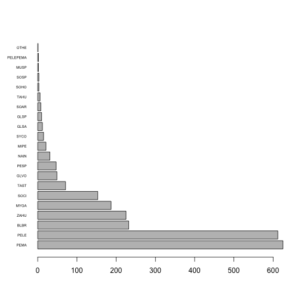
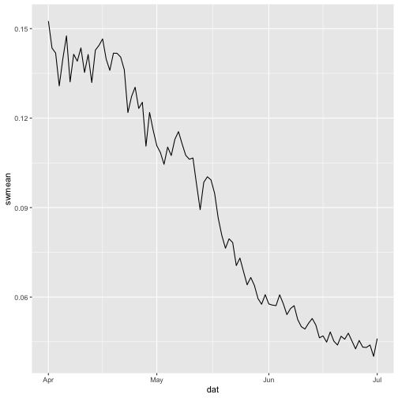
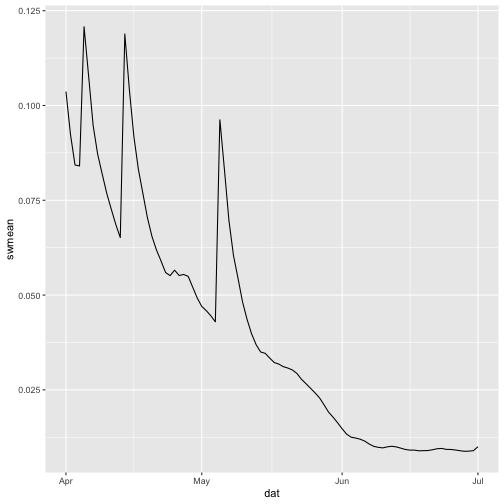
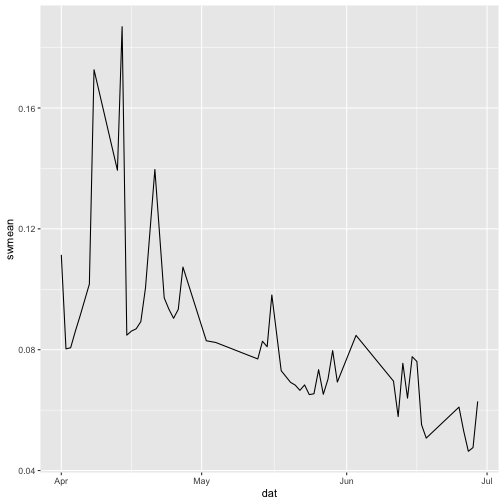
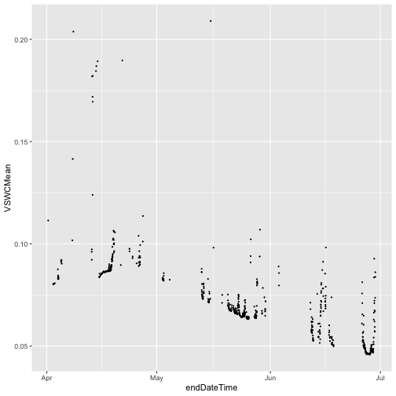

---
output:
  html_document:
    df_print: paged
date: "2025-03-24"
---

## Exploring arrow & dplyr query capabilities

This document explores using arrow functionality to query NEON data without downloading. At the end of the document, there is an outline of possible paths forward, in terms of what functionality to include in neonUtilities and advertise to users, and the pros and cons of the various options.

For background on how this works in the arrow package, see [https://arrow.apache.org/docs/r/articles/data_wrangling.html](https://arrow.apache.org/docs/r/articles/data_wrangling.html)


``` r
library(neonUtilities)
library(arrow)
library(dplyr)
library(lubridate)
library(ggplot2)
```

The neonUtilities version used here is the development version, not the released version.

## Example: Mammal community

Let's start with an example query, and compare processing time in arrow/dplyr versus downloading via neonUtilities. Let's find the species distribution of small mammals captured at TREE.

First, get the list of urls for TREE small mammal capture data and open the dataset. In this code chunk we're using a mix of external and NEON-specific code:

* `queryFiles()` is a neonUtilities function, a wrapper for the new API endpoint that returns the full list of files meeting the search criteria. https://data.neonscience.org/data-api/endpoints/data-query/ 

* `open_csv_dataset()` is an arrow function. It takes a list of filepaths and defines them as a unified dataset, but doesn't download them.

* `schemaFromVar()` is a neonUtilities function that takes a NEON variables file and translates it into an arrow schema, defining the column names and data types for the dataset.


``` r
Sys.time()
```

```
## [1] "2025-04-08 09:16:14 MDT"
```


``` r
urllst <- queryFiles(dpID='DP1.10072.001', site='TREE',
                      package='basic', release='RELEASE-2025', 
                      tabl='mam_pertrapnight', metadata=F,
                      token=Sys.getenv('NEON_TOKEN'))

ds <- open_csv_dataset(sources=urllst[[1]], 
                       schema=schemaFromVar(urllst[[2]], 
                                            'mam_pertrapnight',
                                            'basic'), 
                       skip=1)
```

Now use dplyr to subset the data. This is all standard dplyr syntax; see link above for info about which dplyr functions are supported in arrow. Get the tag and taxonomic identification for each record, and reduce to unique records to account for recaptures of the same individual:


``` r
Sys.time()
```

```
## [1] "2025-04-08 09:16:18 MDT"
```

``` r
mamTREE <- ds |> 
  filter(!is.na(taxonID)) |> 
  select(tagID, taxonID, scientificName) |>
  distinct() |>
  collect()

Sys.time()
```

```
## [1] "2025-04-08 09:16:20 MDT"
```

Finding and querying the data took 8 seconds! (Note that the time estimates throughout are from test runs and might not exactly match the times from when I knit this document. I also tested using both GCS and S3 to get the files, given the issues we're seeing around arrow communication with GCS. Calls using S3 worked fine, but took 2-3 times longer. Final knit of this doc used GCS.)

Plot the distribution of taxa, just to liven up the document.


``` r
barplot(table(mamTREE$taxonID)[order(table(mamTREE$taxonID), 
                                     decreasing=T)], 
        horiz=T, las=1, cex.names=0.5)
```



Let's see how long it takes to do the same thing by downloading and then using dplyr on the data locally.


``` r
Sys.time()
```

```
## [1] "2025-04-08 09:16:20 MDT"
```


``` r
mam <- loadByProduct(dpID='DP1.10072.001', site='TREE',
                     package='basic', release='RELEASE-2025', 
                     check.size=F,
                     token=Sys.getenv('NEON_TOKEN'))

mamTREE_local <- mam$mam_pertrapnight |> 
  filter(!is.na(taxonID)) |> 
  select(tagID, taxonID, scientificName) |>
  distinct()
```


``` r
Sys.time()
```

```
## [1] "2025-04-08 09:16:47 MDT"
```


Same distribution:


``` r
barplot(table(mamTREE_local$taxonID)[order(table(mamTREE_local$taxonID), 
                                     decreasing=T)], 
        horiz=T, las=1, cex.names=0.5)
```


Downloading and then subsetting took 33 seconds. Of course the difference in speed matters more as the size of the dataset increases.

However, consider what happens if we want to take more slices of the dataset. Working with it locally is very fast, but each time we work with the un-downloaded data it makes a new evaluation from the files in the cloud, which is slow relative to local.

For example, let's find out how many captured animals had ticks attached:


``` r
Sys.time()
```

```
## [1] "2025-04-08 09:16:47 MDT"
```

``` r
mamtick <- ds |> 
  filter(!is.na(tickNumber)) |> 
  count() |>
  collect()

Sys.time()
```

```
## [1] "2025-04-08 09:16:49 MDT"
```

``` r
mamtick_local <- mam$mam_pertrapnight |> 
  filter(!is.na(tickNumber)) |> 
  count()

Sys.time()
```

```
## [1] "2025-04-08 09:16:49 MDT"
```

8 seconds to pull the data from the cloud, less than 1 second to run locally.

If you are exploring data, and experimenting with different ways of wrangling, it very quickly becomes much more efficient to download it first. On the other hand, if you know exactly what you're looking for, and you're looking across, say, all OS data products, it's vastly faster not to download.

That makes this functionality incredibly useful internally to NEON, for quality checks such as finding all instances where the year in an eventID doesn't match the year of data collection. For end users, it's more questionable. See Options section at the end of the document for more discussion.

## Joining tables: Mammals and pathogens

We can also use dplyr functionality across tables. Let's find the mammal species at TREE that have tested positive for tick-borne diseases.

First find the files and open the dataset for rodent pathogens at TREE.


``` r
urlrpt <- queryFiles(dpID='DP1.10064.002', site='TREE',
                      package='basic', release='RELEASE-2025', 
                      tabl='rpt2_pathogentesting', metadata=F,
                      token=Sys.getenv('NEON_TOKEN'))

dsrpt <- open_csv_dataset(sources=urlrpt[[1]], 
                       schema=schemaFromVar(urlrpt[[2]], 
                                            'rpt2_pathogentesting',
                                            'basic'), 
                       skip=1)
```

Join to the mammal data and filter to positive pathogen tests.


``` r
mampath <- ds |> 
  select(tagID, taxonID, scientificName, bloodSampleID) |> 
  inner_join(dsrpt, by=c('bloodSampleID' = 'sampleID')) |>
  filter(testResult=='Positive') |>
  distinct() |>
  collect()
```

Taxa that have tested positive for any tick-borne disease, and incidence of positive tests:


``` r
table(mampath$scientificName)
```

```
## 
##    Peromyscus leucopus Peromyscus maniculatus        Zapus hudsonius 
##                     74                     63                      8
```

## Overly simplified analyses

Pulling data in this way makes it easier to overlook some of the details. For example, in the first data slice, we used `distinct()` to remove recaptures of the same individual. But in some cases, animals are recaptured and given a different identification, and we never accounted for that - those instances remain as duplicates in the data above. And we only know this because we included `tagID` in the columns we selected. Someone could easily leave out `tagID`, run `distinct()`, and think they are getting a clean estimate of species composition.

Similarly, there are repeat `tagID`s in the set of mammals with positive pathogen tests. They are a mix of repeat blood draws from the same individual, and individuals that tested positive for multiple pathogens.

Both of these scenarios require something beyond simple data slicing and joining to handle correctly for analysis.

Counterpoint: It is also entirely possible to overlook the same details when analyzing downloaded data.

Counter-counterpoint: At least if you download everything, you can't entirely omit a critical column.

See Options section below for more discussion. For now let's talk about NEON instrument data, where it's very easy to go catastrophically wrong using these tools.

## Example: Soil moisture

Soil moisture is an extremely tempting data product for these tools, since there are 5 plots * 8 depths at each site, leading to data volumes that are hard to download and analyze. Subsetting or aggregating before download makes things much easier! Let's look at what can easily happen if we approach our data query unwisely.

Get the urls for the 30 min soil water and salinity data at SJER in Apr - Jun 2024.


``` r
urlsw <- queryFiles(dpID='DP1.00094.001', site='SJER',
                    package='basic', release='RELEASE-2025', 
                    startdate='2024-04', enddate='2024-06',
                    tabl='SWS_30_minute', metadata=F,
                    token=Sys.getenv('NEON_TOKEN'))

dssw <- open_csv_dataset(sources=urlsw[[1]], 
                       schema=schemaFromVar(urlsw[[2]], 
                                            'SWS_30_minute',
                                            'basic'), 
                       skip=1)
```

And let's say we want a daily mean soil water content, so we use `summarize()` to get the mean without downloading everything. We'll only use data with a final quality flag of 0.


``` r
swmean <- dssw |> 
  filter(VSWCFinalQF==0) |>
  select(endDateTime, VSWCMean) |> 
  mutate(dat = date(endDateTime)) |>
  group_by(dat) |>
  summarize(swmean = mean(VSWCMean, na.rm=T)) |>
  collect()

gg <- ggplot(swmean, aes(dat, swmean)) +
  geom_line()
gg
```



We see a drydown over the 3 months with some noise, it looks plausible, we might easily go away happy.

But remember how instrument data are packaged. There are separate files for each sensor location. We've averaged all the plots and all the depths. That is, theoretically, something someone might want to do, but have we gotten something useful out of it?

Let's break out a single depth in a single plot. To do this, we need to subset the set of urls and open it as a new dataset - the info about plot and depth isn't stored inside the files. We'll look at depth 1 in plot 2.


``` r
url.002.501 <- urlsw[[1]][grep("[.]002[.]501[.]", urlsw[[1]])]

dsswsub <- open_csv_dataset(sources=url.002.501, 
                       schema=schemaFromVar(urlsw[[2]], 
                                            'SWS_30_minute',
                                            'basic'), 
                       skip=1)

swsub <- dsswsub |> 
  filter(VSWCFinalQF==0) |>
  select(endDateTime, VSWCMean) |> 
  mutate(dat = date(endDateTime)) |>
  group_by(dat) |>
  summarize(swmean = mean(VSWCMean, na.rm=T)) |>
  collect()

gg <- ggplot(swsub, aes(dat, swmean)) +
  geom_line()
gg
```



This looks great, showing the drydown and 3 clear rain events, and notably, it's much smoother than what we saw above, even though this is the shallowest soil layer and should be the noisiest. Let's take a look at a deeper layer, depth 6 in plot 4.


``` r
url.004.506 <- urlsw[[1]][grep("[.]004[.]506[.]", urlsw[[1]])]

dsswsub6 <- open_csv_dataset(sources=url.004.506, 
                       schema=schemaFromVar(urlsw[[2]], 
                                            'SWS_30_minute',
                                            'basic'), 
                       skip=1)

sw4.506 <- dsswsub6 |> 
  filter(VSWCFinalQF==0) |>
  select(endDateTime, VSWCMean) |> 
  mutate(dat = date(endDateTime)) |>
  group_by(dat) |>
  summarize(swmean = mean(VSWCMean, na.rm=T)) |>
  collect()

gg <- ggplot(sw4.506, aes(dat, swmean)) +
  geom_line()
gg
```



This looks terrible. And the many straight lines suggest we have a lot of missing data. Let's get the 30 minute data, without averaging over each day, and plot it as points instead of lines.


``` r
sw4.506.30 <- dsswsub6 |> 
  filter(VSWCFinalQF==0) |>
  select(endDateTime, VSWCMean) |> 
  collect()

gg <- ggplot(sw4.506.30, aes(endDateTime, VSWCMean)) +
  geom_point(size = 0.2)
gg
```



This is clear now - there are big gaps, and the data we do have are very noisy. For this particular sensor plot and depth, a daily mean calculation isn't useful, because the underlying data are too low quality.

This also helps us understand the first figure - the noise in the daily average across all plots and depths isn't coming from variation in soil moisture, it's coming from variation in which sensors are broken or flagged at different time intervals. On each day, we were averaging a different subset of 40 sensors and 48 half-hour periods.

As with the OS data, it's possible to make these same mistakes with downloaded data. And there are ways to reduce the problems. We could count the number of points used to calculate each mean, and use that as a post-processing flag. It isn't possible to do this using arrow, though, you have to download and then aggregate. Fortunately arrow gives an informative message about this:


``` r
sw4.506 <- dsswsub6 |> 
  filter(VSWCFinalQF==0) |>
  select(endDateTime, VSWCMean) |> 
  mutate(dat = date(endDateTime)) |>
  group_by(dat) |>
  summarize(swmean = mean(VSWCMean, na.rm=T), ptct = n(VSWCMean)) |>
  collect()
```

```
## Error in `n()`:
## ! Expression not supported in Arrow
## → Call collect() first to pull data into R.
```

But the proper way to do this, for any chunk of data with more than a few missing values, is to discard some of the worst data and then gap-fill, which requires downloading everything and running a fairly complex algorithm with decision trees based on things like length of gap and availability of nearby sensors.


## Example: byEventSIM()

Rather than using the dplyr-arrow interface directly, we can also build wrapper functions, where we control the available querying options. This gives NEON data users access to some of the benefits of these tools, but limits the range of what they can do with them. Example: the prototype neonUtilities function `byEventSIM()`, for querying site management data by event type.


``` r
events <- byEventSIM(eventType='fire', site=c('SOAP','SJER','TEAK','BIGC','TECR'),
                     include.provisional=T, token=Sys.getenv('NEON_TOKEN'))
```

This is a wrapper for:


``` r
urlsim <- queryFiles(dpID='DP1.10111.001', site=c('SOAP','SJER','TEAK','BIGC','TECR'),
                    package='basic', include.provisional=T,
                    tabl='sim_eventData', metadata=F,
                    token=Sys.getenv('NEON_TOKEN'))

dssim <- open_csv_dataset(sources=urlsim[[1]], 
                       schema=schemaFromVar(urlsim[[2]], 
                                            'sim_eventData',
                                            'basic'), 
                       skip=1)

fires <- dssim |> 
  filter(eventType=='fire') |>
  collect()
```


## Options

Big picture, we have very powerful tools that could allow people to access subsets of NEON data quickly and easily. They also allow people to make analytically inappropriate shortcuts, all of which are also possible to do in downloaded data, but are arguably made easier by these tools. At the same time, we have users who are likely to start exploring using these tools, regardless of what we do on our end. Putting out our own tools gives us more control, but also makes risky functionality more widely available, including to users with less expertise. At this stage, what is appropriate to include in NEON's public code packages?

Some possible options, from the most restrictive to the least:

1. The `queryFiles()` function is included in the next release of the neonUtilities package only as an internal helper function, and not made available to the user. It's used to make some downloads more efficient, to facilitate "cloud mode" data transfers, and to enable `byEventSIM()`, but that's all.

2. Option 1 plus, over time, we build an expanded set of wrapper functions for specific types of data subsetting.

3. `queryFiles()` is a public-facing function in neonUtilities, but we don't advertise it or promote it to users. People can do the types of queries demoed above, but they have to figure it out for themselves.

4. Option 3 plus, over time, we build an expanded set of wrapper functions for specific types of data subsetting.

5. `queryFiles()` is a public-facing function in neonUtilities, and we start developing a few tutorials for doing the types of queries demoed above, with appropriate warnings and guidelines.

Risks of option 5:

* People may start to use this as their baseline method for downloading NEON data, especially since it's so fast. We already see users run `loadByProduct()` every time they run their code, because they don't realize it's downloading the same data over and over again. They could easily run big batches of queries over and over again for the same reason. Could it cause problems for us, or for our Google contract, if people use this routinely?

* People consistently ignore warnings and guidelines about best practices for data access and wrangling. No matter what we write in tutorials and vignettes, people will do silly things.

Risk of doing anything other than option 5:

* Some of our highly skilled users are likely to start telling people how to do this no matter what. Would we be better off having a little more control over the messaging?


