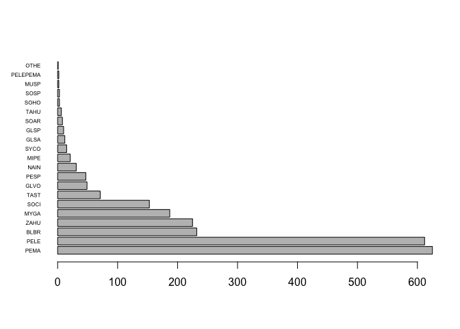
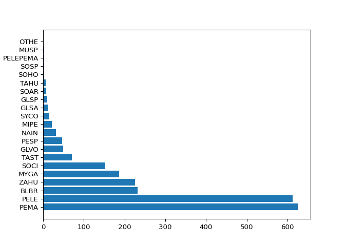
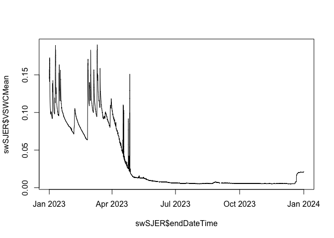
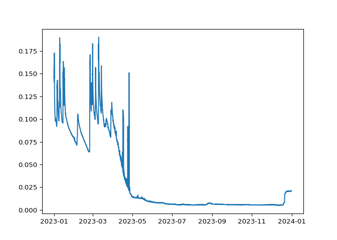
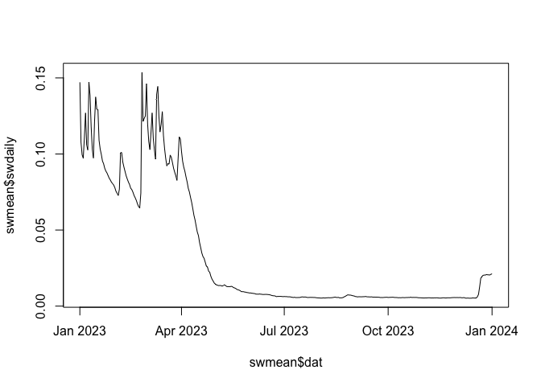
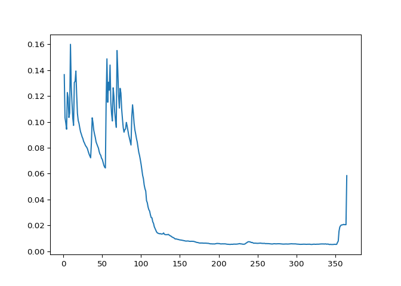
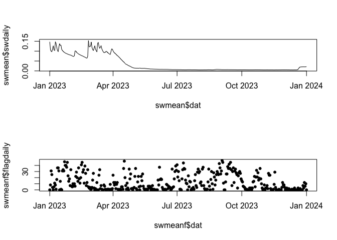
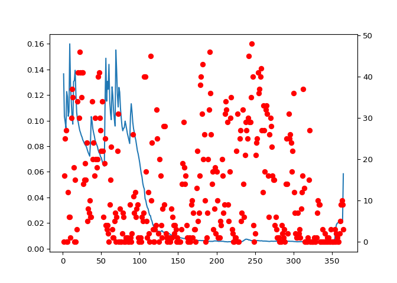

This document explores using arrow functionality to query NEON data
without downloading. Accessing data this way can be much faster than
downloading everything, with some caveats - see the Speed and
Performance section below. The examples used to illustrate the
functionality also demonstrate some of the risks and pitfalls, and lead
to a set of recommendations at the end of the document.

For background on the software backbone we are using for this, see
<https://arrow.apache.org/docs/r/articles/data_wrangling.html> for R
information and
<https://duckdb.org/docs/stable/guides/python/sql_on_arrow.html> for
Python.

### Install Packages

#### R

``` r
install.packages("neonUtilities")
install.packages("dplyr")
```

#### Python

``` python
pip install neonutilities
pip install duckdb
```

### 

### Load packages

#### R

``` r
library(neonUtilities)
library(dplyr)
```

#### Python

``` python

import neonutilities as nu
import duckdb
import matplotlib.pyplot as plt
```

### 

# 1. How to: Capabilities and syntax

### Bind files into a dataset

The arrow software enables us to query many files in a cloud bucket as
if they are a single dataset. But first, we have to point it to the set
of files we’ll be querying, and define those as the dataset of interest.
For NEON data, that generally means choosing the site(s), date(s), and
table of interest.

Because we’re running database-style queries, we can only query one data
table at a time. However, see below to learn how to join tables on the
fly using these tools.

For our first example, we’ll get the mammal trapping data for all time
from Treehaven (TREE) in RELEASE-2025.

#### R

``` r
mamds <- datasetQuery(dpID="DP1.10072.001", 
                      site="TREE", package="basic",
                      tabl="mam_pertrapnight",
                      release="RELEASE-2025",
                      token=Sys.getenv("NEON_TOKEN"))
```

#### Python

``` python

mamds = nu.dataset_query(dpid="DP1.10072.001", 
                         site="TREE", package="basic",
                         tabl="mam_pertrapnight",
                         release="RELEASE-2025")
```

### 

### Database-style query of dataset

We’ve now defined our dataset without downloading anything. We can use
normal `dplyr` syntax in R, and SQL syntax in Python, to query the
dataset and download only the data that match the query. Let’s say we
want to know which species have been captured, and in what numbers:
let’s get the tag and taxonomic identification for each record, and
reduce to unique records to account for recaptures of the same
individual.

#### R

``` r
mamTREE <- mamds |> 
  filter(!is.na(taxonID)) |> 
  select(tagID, taxonID, scientificName) |>
  distinct() |>
  collect()
```

#### Python

``` python

con = duckdb.connect()
mamTREE = con.execute('''
                      SELECT DISTINCT tagID, taxonID, scientificName 
                      FROM mamds WHERE taxonID != ''
                      ''').df()
```

### 

We’ve easily accessed data on the distribution of taxa, without
downloading all the rest of the associated data. Let’s make a simple
plot of the distribution.

### 

#### R

``` r
ct <- table(mamTREE$taxonID)

barplot(ct[order(ct, decreasing=T)], 
        horiz=T, las=1, cex.names=0.5)
```

<!-- -->

#### Python

``` python
ct = mamTREE.taxonID.value_counts()

fig, ax = plt.subplots()
ax.barh(y=ct.keys(), width=ct)
plt.show()
```



### 

### Joining data tables

As noted above, we can only query one data table at a time. However, we
can use database-style joining functionality as well, and join tables as
we access them. Let’s find the mammal species at TREE that have tested
positive for tick-borne diseases. This will require querying the rodent
pathogen data product (Rodent pathogen status, tick-borne
(DP1.10064.002)) as well as the mammal trapping data, and joining the
results.

First define the dataset for rodent pathogens at TREE.

#### R

``` r
pthds <- datasetQuery(dpID="DP1.10064.002", 
                      site="TREE", package="basic",
                      tabl="rpt2_pathogentesting",
                      release="RELEASE-2025",
                      token=Sys.getenv("NEON_TOKEN"))
```

#### Python

``` python

pthds = nu.dataset_query(dpid="DP1.10064.002", 
                         site="TREE", package="basic",
                         tabl="rpt2_pathogentesting",
                         release="RELEASE-2025")
                         
```

### 

### 

Now we join the pathogen data to the mammal trapping dataset and filter
to positive pathogen tests. Note that the mammal input at this step is
the arrow dataset - the set of files in the cloud - not the data table
we downloaded earlier. As with the data queries, we use standard `dplyr`
or SQL syntax.

From the joined data, take a look at which taxa have tested positive for
any pathogen.

#### R

``` r
mampath <- mamds |> 
  select(tagID, taxonID, scientificName, bloodSampleID) |> 
  inner_join(pthds, by=c('bloodSampleID' = 'sampleID')) |>
  filter(testResult=='Positive') |>
  distinct() |>
  collect()

table(mampath$scientificName)
```

    ## 
    ##    Peromyscus leucopus Peromyscus maniculatus        Zapus hudsonius 
    ##                     74                     63                      8

#### Python

``` python
mampath = con.execute('''
                      SELECT tagID, taxonID, scientificName, bloodSampleID 
                      FROM mamds 
                      INNER JOIN pthds 
                      ON mamds.bloodSampleID = pthds.sampleID 
                      WHERE testResult = 'Positive'
                      ''').df()

mampath.scientificName.value_counts()
```

    ## scientificName
    ## Peromyscus leucopus       74
    ## Peromyscus maniculatus    63
    ## Zapus hudsonius            8
    ## Name: count, dtype: int64

### 

### Access and query NEON sensor data

The examples we’ve explored so far have been observational (OS) data.
These methods are extremely appealing for use with NEON sensor (IS)
data, because IS data volumes are large, and can be time-consuming to
download and resource-intensive to process. Being able to subset before
downloading has the potential to make working with these data much
faster and easier.

BUT: there are major limitations due to the way IS data files are
structured and named. One of the biggest issues is that IS data don’t
contain location information - the site, horizontal index, and vertical
index - as data fields, but there can be many sensors per site. Because
the location information is only in the file name, the query tools can’t
distinguish data collected by different sensors.

To avoid queries running across sensors, the `datasetQuery()` (R) and
`dataset_query()` (Python) functions require that sensor datasets be
defined only for a single sensor. `site`, `hor`, and `ver` are all
required inputs for sensor data products, and can only be of length 1.

Even with access restricted to one sensor, these tools can be very
useful. Let’s say we want an estimate of soil moisture at San Joaquin
Experimental Range (SJER) in 2023, and let’s say we don’t need our
estimate to be extremely precise, either in space or in time. One sensor
at a 30-minute frequency is fine. On the NEON Data Portal, our only
option would be to download all Soil water content and salinity
(DP1.00094.001) data for 2023. That is, 5 soil plots times 8 soil depths
= 40 sensors, each at both 1- and 30-minute averaging intervals. It adds
up to 2.26 GB.

Instead, let’s get just the 30-minute dataset for the sensor at HOR=004
(soil plot 4) and VER=502 (soil depth 2).

#### R

``` r
swds <- datasetQuery(dpID="DP1.00094.001", 
                     site="SJER", package="basic",
                     hor="004", ver="502",
                     startdate="2023-01", enddate="2023-12",
                     tabl="SWS_30_minute",
                     release="RELEASE-2025")
```

#### Python

``` python

swds = nu.dataset_query(dpid="DP1.00094.001", 
                         site="SJER", package="basic",
                         hor="004", ver="502",
                         startdate="2023-01", enddate="2023-12",
                         tabl="SWS_30_minute",
                         release="RELEASE-2025")
```

### 

We want all the data from this sensor, so instead of running a query to
subset, we return the full data table, and plot a time series of the
results.

### 

#### R

``` r
swSJER <- swds |>
  collect()

plot(swSJER$VSWCMean~swSJER$endDateTime, type="l")
```

<!-- -->

#### Python

Note that the SQL statement here is enclosed in double quotes, rather
than 3 single quotes as in the queries above. Since this query is short,
it fits easily on one line and is very readable. Using 3 single quotes
lets us use multiple lines for the query.

``` python
swSJER = con.execute("SELECT * FROM swds").df()

fig, ax = plt.subplots()
ax.plot(swSJER.endDateTime, swSJER.VSWCMean)
plt.show()
```



### 

### Averaging on the fly

For sensor data, users are often interested in aggregating data to
longer averaging intervals. It’s possible to do this on the fly, before
downloading, using these query tools, but there are some significant
caveats.

Let’s say we want the daily mean soil moisture from SJER, instead of the
30-minute data. The first important consideration: we’ll omit records
with the final quality flag (`VSWCFinalQF`) raised.

#### R

``` r
swmean <- swds |> 
  filter(VSWCFinalQF==0) |>
  select(endDateTime, VSWCMean) |> 
  mutate(dat = date(endDateTime)) |>
  group_by(dat) |>
  summarize(swdaily = mean(VSWCMean, na.rm=T)) |>
  arrange(dat) |>
  collect()

plot(swmean$swdaily~swmean$dat, type="l")
```

<!-- -->

#### Python

``` python
swmean = con.execute('''
                     SELECT 
                        EXTRACT(DAYOFYEAR FROM endDateTime) AS dat,
                        AVG(VSWCMean) AS swdaily
                     FROM swds 
                     WHERE VSWCFinalQF = 0 
                     GROUP BY 
                        EXTRACT(DAYOFYEAR FROM endDateTime)
                     ORDER BY dat
                     ''').df()

fig, ax = plt.subplots()
ax.plot(swmean.dat, swmean.swdaily)
plt.show()
```



### 

The catch is that although we’ve omitted flagged data records, we don’t
know which time periods were affected, nor how much data was omitted.
The records were left out of the mean silently. Let’s make another
calculation: the sum of the absolute value of `VSWCFinalQF`. Most sensor
data quality flags at NEON can take 3 possible values: 0 = pass, 1 =
fail, -1 = could not be evaluated. Summing the absolute value will give
us a count of records that did not pass on each day.

Plot the flag count on top of the daily mean data.

### 

#### R

``` r
swmeanf <- swds |> 
  select(endDateTime, VSWCFinalQF) |> 
  mutate(dat = date(endDateTime)) |>
  group_by(dat) |>
  summarize(flagdaily = sum(abs(VSWCFinalQF)), na.rm=F) |>
  arrange(dat) |>
  collect()

layout <- layout(matrix(c(1,2), 2, 1, byrow = F)) 
layout <- plot(swmean$swdaily~swmean$dat, type="l")
layout <- plot(swmeanf$flagdaily~swmeanf$dat, pch=20)
```

<!-- -->

#### Python

``` python
swmeanf = con.execute('''
                     SELECT 
                        EXTRACT(DAYOFYEAR FROM endDateTime) AS dat,
                        SUM(flagabs) AS flagdaily
                     FROM (SELECT 
                              endDateTime,
                              ABS(VSWCFinalQF) AS flagabs
                           FROM swds)
                     GROUP BY 
                        EXTRACT(DAYOFYEAR FROM endDateTime)
                     ORDER BY dat
                     ''').df()

fig, ax1 = plt.subplots()
ax2 = ax1.twinx()

ax1.plot(swmean.dat, swmean.swdaily)
ax2.scatter(swmeanf.dat, swmeanf.flagdaily, c='r')
plt.show()
```



### 

That is a lot of flags! To understand how to interpret these flags, and
which daily mean values are reliable, we would need to examine the
detailed quality flags. If we need a continuous time series, we would
need to do some gap-filling of the omitted data. But the daily mean data
we aggregated from the cloud don’t include the full set of flags and
values from the original data. Which brings us to the limitations and
challenges of these methods.

# 2. Pitfalls, risks, and limitations

### Contextual data and metadata

Querying data in this way makes it dangerously easy to overlook some of
the details. For example, in the first query we ran on the mammal
captures, we used `distinct()` to remove recaptures of the same
individual. But let’s check for repeated `tagID`s in the table of taxa.

### 

#### R

``` r
tagdups <- mamTREE |>
  group_by(tagID) |>
  filter(n() > 1) |>
  ungroup() |>
  arrange(tagID)

head(tagdups, 10)
```

    ## # A tibble: 10 × 3
    ##    tagID              taxonID scientificName        
    ##    <chr>              <chr>   <chr>                 
    ##  1 NEON.MAM.D05.L1808 PEMA    Peromyscus maniculatus
    ##  2 NEON.MAM.D05.L1808 PELE    Peromyscus leucopus   
    ##  3 NEON.MAM.D05.L3692 PELE    Peromyscus leucopus   
    ##  4 NEON.MAM.D05.L3692 PEMA    Peromyscus maniculatus
    ##  5 NEON.MAM.D05.L6026 GLVO    Glaucomys volans      
    ##  6 NEON.MAM.D05.L6026 GLSP    Glaucomys sp.         
    ##  7 NEON.MAM.D05.L6026 GLSA    Glaucomys sabrinus    
    ##  8 NEON.MAM.D05.L7847 PELE    Peromyscus leucopus   
    ##  9 NEON.MAM.D05.L7847 PEMA    Peromyscus maniculatus
    ## 10 NEON.MAM.D05.R1395 PEMA    Peromyscus maniculatus

#### Python

``` python

# TBD
```

### 

This is very clear - in some cases, the same animal is captured multiple
times and identified differently. And we only know this because we
included `tagID` in the columns we selected. Someone could easily leave
out `tagID`, run `distinct()`, and think they are getting a clean
estimate of species composition.

On the flip side, deciding what to do with these multiple
identifications depends on data we didn’t include in our query. For
example, some of these individuals may have been caught many times.
Which identification is the most common? Or maybe an individual was
caught both as a juvenile and as an adult - presumably we would be more
confident in the adult identification. To make those decisions, we need
the full set of trapping data.

Is there anything similar going on in the pathogen data?

### 

#### R

``` r
pathdups <- mampath |>
  group_by(tagID) |>
  filter(n() > 1) |>
  ungroup() |>
  select(tagID, scientificName, 
         collectDate, testPathogenName) |>
  arrange(tagID, collectDate)

head(pathdups, 21)
```

    ## # A tibble: 21 × 4
    ##    tagID              scientificName         collectDate testPathogenName       
    ##    <chr>              <chr>                  <date>      <chr>                  
    ##  1 NEON.MAM.D05.L7097 Zapus hudsonius        2021-06-16  Babesia microti        
    ##  2 NEON.MAM.D05.L7097 Zapus hudsonius        2021-06-16  Anaplasma phagocytophi…
    ##  3 NEON.MAM.D05.L8759 Peromyscus leucopus    2023-09-14  Babesia microti        
    ##  4 NEON.MAM.D05.L8759 Peromyscus leucopus    2023-09-14  Ehrlichia muris-like   
    ##  5 NEON.MAM.D05.R6010 Peromyscus maniculatus 2020-09-23  Ehrlichia muris-like   
    ##  6 NEON.MAM.D05.R6010 Peromyscus maniculatus 2020-09-23  Babesia divergens      
    ##  7 NEON.MAM.D05.R6349 Peromyscus leucopus    2020-07-29  Babesia microti        
    ##  8 NEON.MAM.D05.R6349 Peromyscus leucopus    2020-07-29  Anaplasma phagocytophi…
    ##  9 NEON.MAM.D05.R6540 Peromyscus maniculatus 2020-07-30  Babesia divergens      
    ## 10 NEON.MAM.D05.R6540 Peromyscus maniculatus 2020-07-30  Babesia microti        
    ## # ℹ 11 more rows

#### Python

``` python

# TBD
```

### 

There are several repeat `tagID`s in the set of mammals with positive
pathogen tests. We can see the majority of them are individuals that
tested positive for multiple pathogens (poor NEON.MAM.D05.R7185 tested
positive for 4 pathogens), but see also NEON.MAM.D05.R7453, which was
captured in 2021 and 2022 and tested positive for *Babesia microti* both
times.

How to handle the re-identified recaptures and the repeat pathogen tests
depends on your analysis, but both scenarios require something beyond
simple data slicing and joining.

Counterpoint: It is also entirely possible to overlook the same details
when analyzing downloaded data.

Counter-counterpoint: At least if you download everything, you can’t
entirely omit a critical column. If you go looking for contextual data,
you already have it in memory.

### Aggregated data

Aggregating time series data vastly reduces the demand on compute and
the time needed to access data. But it also introduces huge risks by
discarding or averaging away missing or erroneous data points, usually
invisibly.

The impact of ignoring gaps depends on your analysis, of course, as well
as the extent of the gaps. But for any analysis that requires high
precision and accuracy, careful attention to gap-filling is necessary.

(examples here)

# 3. Speed and performance

Downloading complete datasets is slower than querying NEON data files in
the cloud, but querying a dataset in local memory is very fast. This
means if you are making a number of queries, the speed advantage of
cloud queries may disappear.

For example, let’s compare the speed of downloads vs cloud queries for
surface water chemistry data. We’ll run a very simple query: All
analytical records for total nitrogen from McRae Creek (MCRA).

### 

#### R

``` r
start.time <- Sys.time()

wcds <- datasetQuery(dpID="DP1.20093.001", 
                      site="MCRA", package="basic",
                      tabl="swc_externalLabDataByAnalyte",
                      release="RELEASE-2025",
                      token=Sys.getenv("NEON_TOKEN"))

Sys.time() - start.time
```

    ## Time difference of 6.894525 secs

``` r
tn <- wcds |>
  filter(analyte=="TN") |>
  collect()

Sys.time() - start.time
```

    ## Time difference of 11.60115 secs

#### Python

``` python

wcds = nu.dataset_query(dpid="DP1.20093.001", 
                         site="MCRA", package="basic",
                         tabl="swc_externalLabDataByAnalyte",
                         release="RELEASE-2025")
```

### 

And now, let’s get the same data by downloading and then subsetting the
dataset.

### 

#### R

``` r
start.time <- Sys.time()

wclist <- loadByProduct(dpID="DP1.20093.001", 
                      site="MCRA", package="basic",
                      release="RELEASE-2025",
                      check.size=F, progress=F,
                      token=Sys.getenv("NEON_TOKEN"))

Sys.time() - start.time

    ## Time difference of 48.28636 secs

tnl <- wclist$swc_externalLabDataByAnalyte |>
  filter(analyte=="TN") |>
  collect()

Sys.time() - start.time

    ## Time difference of 48.29913 secs
```

#### Python

``` python
wclist = nu.dataset_query(dpid="DP1.20093.001", 
                         site="MCRA", package="basic",
                         check_size=False, progress=False,
                         release="RELEASE-2025")
```

### 

Finding the dataset in the cloud took 6 seconds, vs 48 seconds to
download the data. But querying the data in the cloud took an additional
5 seconds, vs 0.01 seconds to subset the data locally. Obviously the
exact numbers will vary depending on the specific data product and
query, but the overall pattern here is representative: making a single
data request to the cloud is much faster than downloading, but making
multiple queries can very quickly add up to more time than downloading.

Given the limitations described above, the speed and performance we
observe, and the pitfalls, what do we recommend?

# 4. Recommendations

### What these tools are good for

#### Highly targeted searches

Database-style queries in the cloud are an excellent tool when you know
exactly what you’re looking for, and what you’re looking for is a small
subset of a large amount of data. Some examples:

- Find every site where NEON has observed a particular species
- Find the diameter measurements over time of a specific individual tree
- 
- 

#### Data subsets not supported by the NEON data model

NEON allows data download by data product, site, and month. As we saw
above, if you only need data from a single sensor, it can be much faster
to access that specific sensor’s files using these tools. If you do
this, we highly recommend you don’t subset the columns - get all of the
data and metadata associated with each record, so you have the full set
of contextual data and quality flags.

Similarly, if you’re looking for something that occurs at unpredictable
intervals, being able to search for that specific something, rather than
downloading everything and then looking for it, can be much faster. To
support this scenario, the `neonUtilities` R package now includes the
function `byEventSIM()` for accessing site management data
(DP4.10111.001) by event type, built on a backbone of arrow dataset
capabilities. This allows you to search for e.g. all fires at NEON
sites, rather than downloading all of the site management data and
subsetting to fires.

### What these tools are not good for

#### Data exploration

When you are exploring a new dataset and learning about what it
contains, you are likely to make many different slices, aggregations,
and summaries of it. Doing this using cloud queries will, in the end, be
much slower than downloading the data and then exploring. If the volume
of data is too large to download all of it, download one site, or one
year at one site, and use that as a testbed before proceeding.

#### Data reshaping

If you need a large amount of data, but in a different format than NEON
presents (e.g. long vs wide), accessing the data this way is not
efficient. Download the data you need, and then rearrange.
